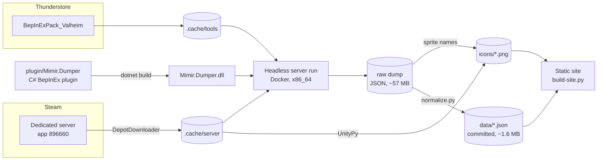
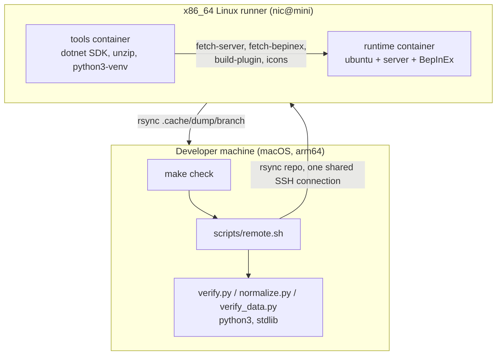
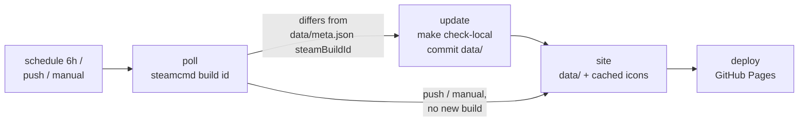
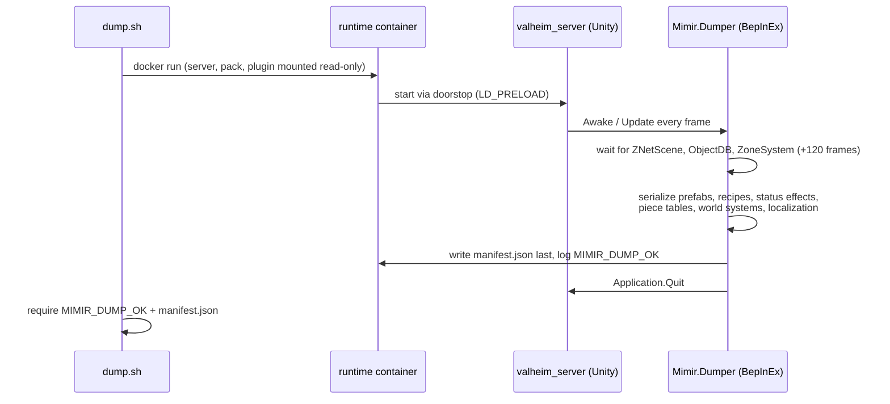
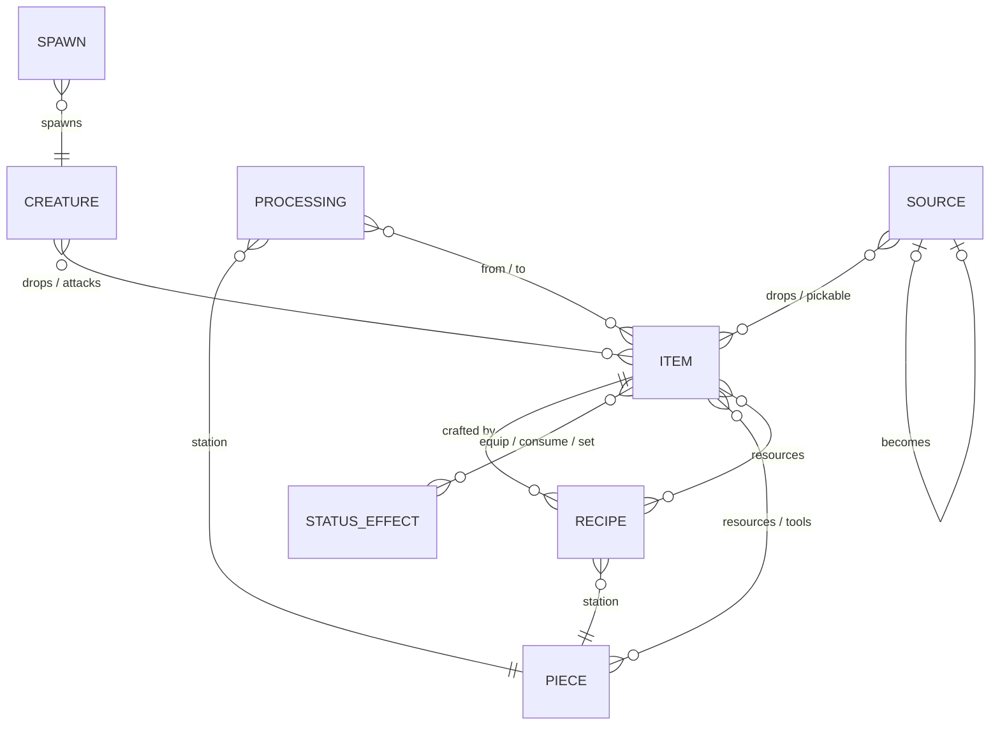

# Architecture

mimir keeps a Valheim reference site in sync with the game by extracting data from the game itself instead
of maintaining it by hand. The key constraint is that this must run unattended, so it uses the **dedicated
server**, which Steam lets anyone download anonymously, instead of the game client.

## Pipeline overview

Everything in `.cache/` is downloaded or generated and gitignored. Only `data/` is committed. That gives a
readable diff per game update and keeps Iron Gate's files (binaries, assets, icons) out of git.

## Where things run

The server is a Unity/Mono x86_64 Linux binary. Mono's JIT needs `MAP_32BIT` memory, which neither Rosetta
nor qemu-user provides, so the dump step needs **real x86_64** hardware. Everything else runs anywhere.

The runner only needs Docker and SSH. Any script whose tools are missing on the host (`in_tools` in
`scripts/lib.sh`) re-runs itself inside the tools container, with the repo mounted at the same path.

### CI (GitHub Actions)

`.github/workflows/update.yml` runs the same pipeline unattended on `ubuntu-24.04` (real x86_64, Docker,
free for public repos). Only the public Steam branch is tracked.

- The build id comes from Valve's `steamcmd` (anonymous `app_info_print`, `scripts/steam-buildid.sh`); normalize
  stores it as `steamBuildId` in `meta.json` (from `$MIMIR_STEAM_BUILDID`, otherwise carried over).
- Icons are cached per build id (`actions/cache`, evicted after 7 days unused); on a miss the site job
  re-extracts them. They are deployed with the site, never committed.
- Commits made with `GITHUB_TOKEN` don't trigger workflows, so the deploy runs in the same workflow run.
- GitHub disables scheduled workflows after 60 days without repo activity (it emails first); re-enable in the
  Actions tab.

## The dump (plugin)

The plugin is **read-only and generic**. It walks every game MonoBehaviour and ScriptableObject and writes
each field by Unity's own serialization rules (public or `[SerializeField]`), so fields added in a patch
show up without code changes. References become `{"$ref": prefab}`, sprites `{"$sprite": name}`, and other
assets `{"$asset": name}`. It never patches game code.

## Data model (`data/`)

- Ids are prefab names, and references hold ids.
- English text is resolved.
- Empty, zero, false and `Normal` values are omitted.
- `normalize.py` is deterministic (sorted, no timestamps).
- Reverse relations ("used in", "dropped by") are derived by the site build, not stored.
- A spawn's `source` says where the creature comes from: world spawns, raids, locations and their dungeons
  (from the plugin's `locations/` and `rooms/` dump), offspring and eggs. Creatures with no spawn at all are boss
  phases and summons, or unused in vanilla worldgen.

## Site

`scripts/build-site.py` (stdlib only) turns `data/` + icons into `.cache/site/<branch>/`: one page per item,
creature, piece and status effect, index pages, and `search.json` for the client-side search in `site/search.js`.
Pages set `<base href>` to the site root, so the output works from any sub-path or straight from disk. Per-quality
stats and upgrade costs use the game's formulas (cited in the script header). Internal items (creature attacks)
get no page; they show on their creature. The build fails if any page links to a file it didn't write.

The creatures index groups by **home biome**, in progression order (Meadows → … → Deep North, then Ocean, Other).
Each world, location or dungeon spawn spreads one unit of weight over its biomes; the heaviest biome wins, the
earliest on a tie. Raids and spawns everywhere don't count, offspring and hatchlings inherit from their parents, and
creatures with no biome (boss phases, summons, unplaced prefabs) go under Other. Bosses list first in their biome.

Creatures and items that share a display name are told apart in the site build. Identical copies (same data apart
from the id, e.g. `Troll` / `Troll_sleeping`, `FishRaw` / `FishAnglerRaw`) merge into the page of the shortest id;
links, relations and spawns of the copy go there. The rest get a qualifier from the id words they don't share,
mapped through `QUALIFIERS` in `build-site.py`: "Skeleton (Swamp, no bow)", "Kall Fimbulbringer (phase 2)",
"Plains Pie Picnic (material)".

## Verification

Each stage has an invariant check that fails loudly, so an agent can run the whole thing unattended:

| Stage | Check |
|---|---|
| dump | `MIMIR_DUMP_OK` in the log, `manifest.json` present, no warnings, no skipped or unsupported fields |
| raw dump | `verify.py`: counts, known vanilla content (Bronze Sword recipe, Troll drops, Eikthyr boss, ...), icons |
| data | `verify_data.py`: counts, every reference resolves, every icon exists, known content |
| site | `build-site.py` fails on any broken internal link |

The checks test invariants rather than exact values, so balance patches pass but broken extraction fails.

`make test` covers the code without a dump or the network: `tests/fixture.py` builds a tiny synthetic raw dump
(invented names and numbers, no game data), `tests/test_normalize.py` unit-tests the normalize helpers on it and
compares a full normalize run with `tests/golden/`, `tests/test_site.py` builds the site from the golden output,
and `verify_data.py` re-checks the committed `data/`. After a deliberate output change, regenerate the golden
files with `MIMIR_UPDATE_GOLDEN=1 python3 -m unittest tests/test_normalize.py` and review their diff.
CI runs `make test` on every push and pull request (`.github/workflows/test.yml`), and first thing in
`make check-local`, so a data update is never committed by code that fails its tests.
